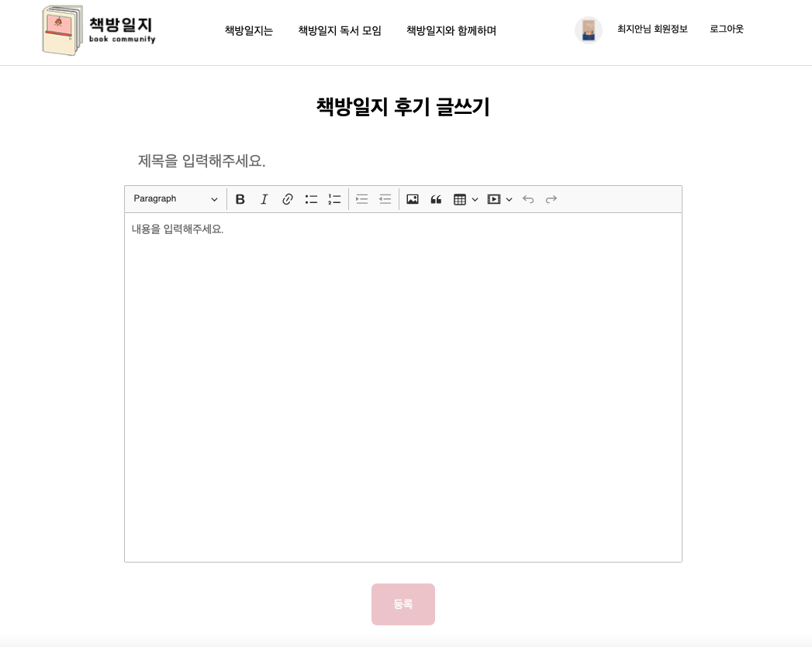
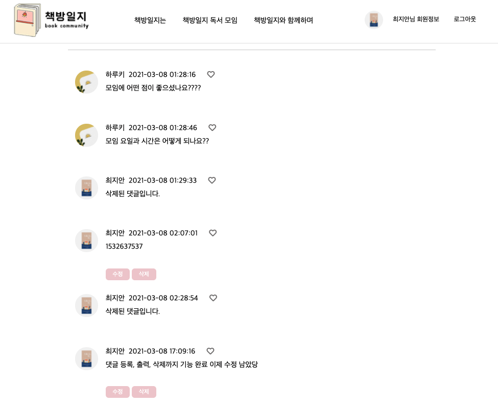
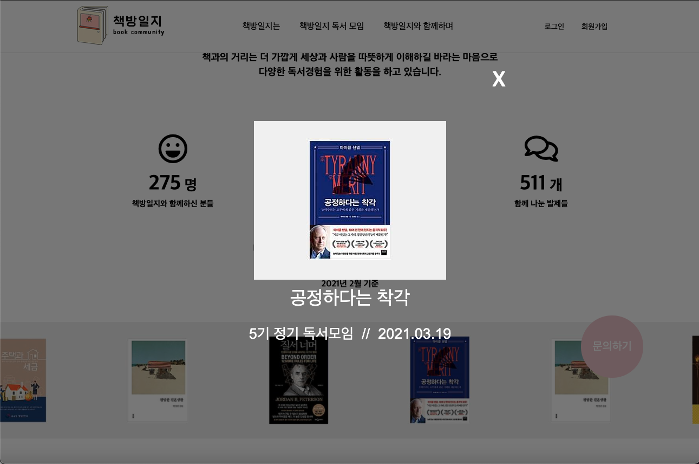
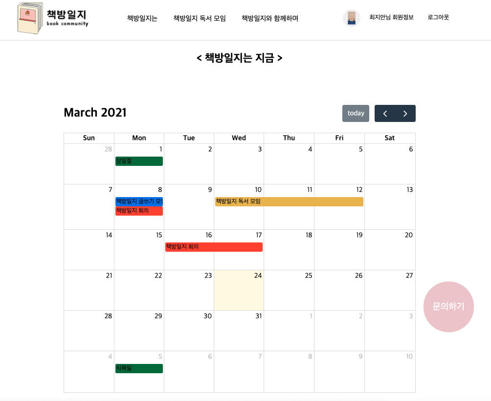

# project-dailyrecordofbook (독서 커뮤니티 웹사이트)
개인 프로젝트 / 책방일지 (개발 진행 중)

[책방일지 사이트 바로가기](http://49.50.165.50:8080/main/home)

 

## 목차
1. 만들게 된 계기
2. 기능 설명
3. 사용 기술
4. 개발진
5. 추가중인 기능

 
 

## 1. 만들게 된 계기
> 독서 커뮤니티 홍보 및 활성화를 위한 사이트로 실제로 배포하여 사용하기 위해 개발 중이며
> 
> 기본적인 게시판의 기능을 최대한 구현, 활용하여 개발 중
> 

 
 

## 2. 기능 설명
> ### - 회원 기능
> * 이메일을 아이디로 사용하였고 회원가입시 해당 메일로 인증 코드를 발송,
> 
>   메일에 코드를 클릭해서 인증을 거쳐야 로그인 가능
>   
>     
>

 
 

> ### - CRUD 기능의 게시판 
> 
> * CKEditor5 (WYSIWYG Editor) 사용
>
> * 에디터 내용 중 첫 번째 이미지를 메인 이미지로 DB에 저장하여 게시글 리스트를 출력할 때 사용
>
> * 댓글 작성 기능을 구현 (현재 좋아요 기능, 대댓글 기능 구현 중)
>
> * 모집 및 공지사항은 관리자만 작성 가능, 모임이 완료된 글은 모집완료 카테고리로 변경 가능  
> 
>     
>

 
 

> ### - 모임에서 읽은 책들을 DB에 추가하여 메인 페이지에서 롤링
>  * 클릭하면 modal 창이 열리고 입력한 도서 제목 및 데이터를 볼 수 있다.
>
> 
>

 
 

> ### - 구글 캘린더를 연동하여 책방 모임 일정 및 활동 공유
> 
> 
>

 
 

## 3. 사용 기술

 
 

## 4. 개발진 

|  
최지안
 |  
최지안
 |  
최지안
 |
|:--------:|:--------:|:--------:|
|
wldks79@naver.com
 | 
wldks79@naver.com
 |
wldks79@naver.com
 |
|

 | 

 |

 |
|
cell 1x2 
 | 
cell 3x2 
 |
cell 1x2 
 |

 
 

## 5. 추가 중인 기능
* 좋아요 기능, 대댓글 기능
* 인스타그램 글 이미지를 가지고 와서 해당 글 링크 걸기
* 독서 토론 게시판 (도서 정보를 api로 가지고 와서 활용할 계획)

